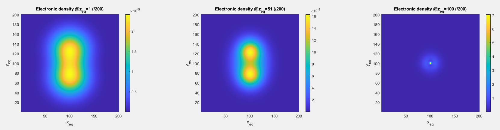
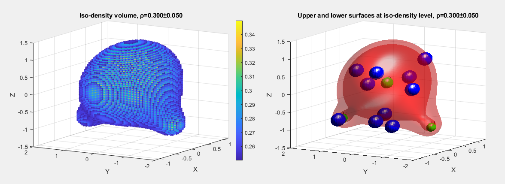

# 056921 Sperimentazione e Analisi dei Dati

A `MATLAB`-based data analysis pipeline for processing and visualizing volumetric electron density data from computational chemistry `.cube` files.


## Story

This project was created as part of the final assignment for the course "Sperimentazione e Analisi dei Dati" (Experimentation and Data Analysis).
In fact, this wasn't supposed be one of my classes and never have been.
However, a friend of mine enrolled in this course had to complete this project, and I was curious about the challenges it presented and decided to give it a try myself.
My friend ended up receiving full marks for their work on this project.


## Objective

The primary goal was to apply data analysis techniques to a practical problem, moving from raw data to meaningful interpretation and visualization.

The challenge was to parse a `.cube` file, a format common in computational chemistry, to extract the structure of a molecule and visualize its **electron density field**.
This involved understanding the file specification, processing the data, and representing it in a human-interpretable way.
Saving the molecular structure in a standard format (`.xyz`) and generating plots of the electron density were also objectives of the project.


## Overview

The project is a `MATLAB` script (`Main.m`) that serves as a small pipeline for analyzing molecular data.
It reads atomic coordinates and volumetric data from a `.cube` file, analyzes the electron density, and produces visualizations and output files.
For enhanced analysis capabilities, the script also includes a function to read and interpret data from an external periodic table file (`periodic-table.xlsx`).
This allows the script to map atomic numbers to element symbols, properties, and other relevant chemical information.

### Cube File Format

A base example about a `H2O` molecule is given below:

```txt
DENSITY: cube file

    3    0.000000    0.000000    0.000000
   40    0.283459    0.000000    0.000000
   40    0.000000    0.283459    0.000000
   40    0.000000    0.000000    0.283459
    8    0.000000    5.488739    5.669178    5.530722
    1    0.000000    5.481031    5.669178    7.365260
    1    0.000000    7.258770    5.669178    5.048463
 -0.16222E-08 -0.63049E-09 -0.19385E-08  0.57725E-08  0.20122E-08  0.80265E-08
  0.17947E-07  0.20526E-07  0.15315E-07  0.35011E-07  0.27647E-07  0.43313E-07
  0.44212E-07  0.30527E-07  0.36826E-07  0.22157E-07  0.24714E-07  0.13670E-07
  0.12920E-07  0.24576E-08  0.55661E-08  0.45910E-08  0.70815E-08  0.13490E-07
  0.15613E-07  0.27410E-07  0.24892E-07  0.32935E-07  0.44462E-07  0.38455E-07
  0.41501E-07  0.35582E-07  0.42141E-07  0.32768E-07  0.26886E-07  0.13806E-07
  0.16753E-07  0.69943E-08  0.76448E-08  0.19768E-08
  ...
```

The file can be further splitted into two parts: the header and the data.
For a complete description of the file format, please refer to the [official documentation](https://h5cube-spec.readthedocs.io/en/latest/cubeformat.html).

#### Header

The header of the file contains the following information:

- The number of atoms in the molecule: `3`
- The origin of the grid: `0.000000 0.000000 0.000000`
- The number of points in the grid (X, Y, Z): `40 40 40`
- Definition of the grid properties (X, Y, Z): `0.283459 0.000000 0.000000`, ...
- The atomic number and the position of each atom in the molecule: `8 5.488739 5.669178 5.530722`, ...

For case at hand, the molecule is composed of `3` atoms, where the first atom is an `Oxygen` atom (`8`), and the other two atoms are `Hydrogen` atoms (`1`).
Which, of course, corresponds to a `H2O` molecule.

#### Data

The data part of a `cube` file is a 3D matrix of values.
Notice that the flexibility of the file allows to store any kind of data, but in this case, the data is the electronic density field of the molecule.

Following a standard order, one might read each value in the data section and correctly position it in the 3D representation of the molecule.
In the example above, the data section starts with `-0.16222E-08`, and goes on with precisely `40*40*40` values (that are the one specified in the header).


## Quick Start Guide

To run this project, you will need `MATLAB` installed.

Make sure to correctly adapt the paths in the `Main.m` script to point to the location of your `.cube` file and the `periodic-table.xlsx` file.
I would suggest to keep all the input files in a same subdirectory called `Cube files`, and the `periodic-table.xlsx` file in the main directory.

The script will generate a `molecule.xyz` file with the molecule's structure and display plots of the electron density.


## Examples of Output

The script successfully extracts the molecule's structure and saves it in the standard `.xyz` format. For the provided H2O example, the output is:

```
3
H2O
O 0.0000 0.0000 0.2253
H 0.0000 1.4348 -0.9012
H -0.0000 -1.4348 -0.9012
```

Additionally, it produces both 2D and 3D visualizations of the molecule's electron density field, offering a clear interpretation of the volumetric data.

<div align="center">

<br>
<figcaption>
    H2O molecule electronic density at different Z levels.
    The hydrogen atoms are clearly visible in the first 2 images, while the oxygen atom is visible in the rightmost image.
</figcaption>
</div>

<br>

<div align="center">

<br>
<figcaption>
    3D representation of the H2O molecule electronic density field.
    The blue dots represent atoms of Lithium, added as requested in the challenge.
</figcaption>
</div>


Have a nice coding day,

Tommaso :panda_face: